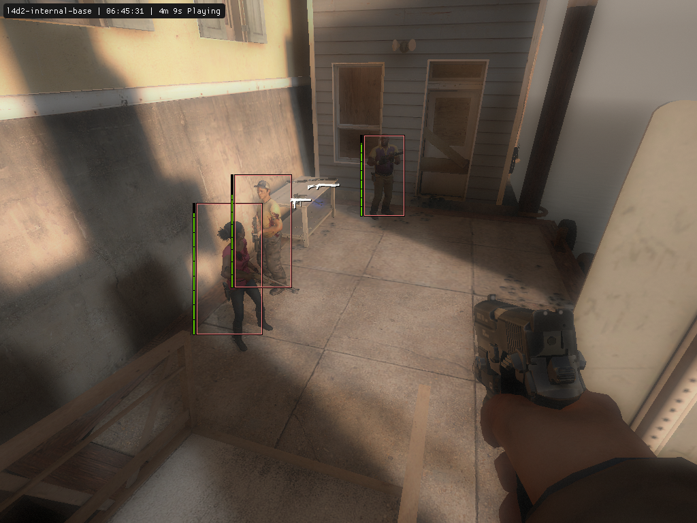
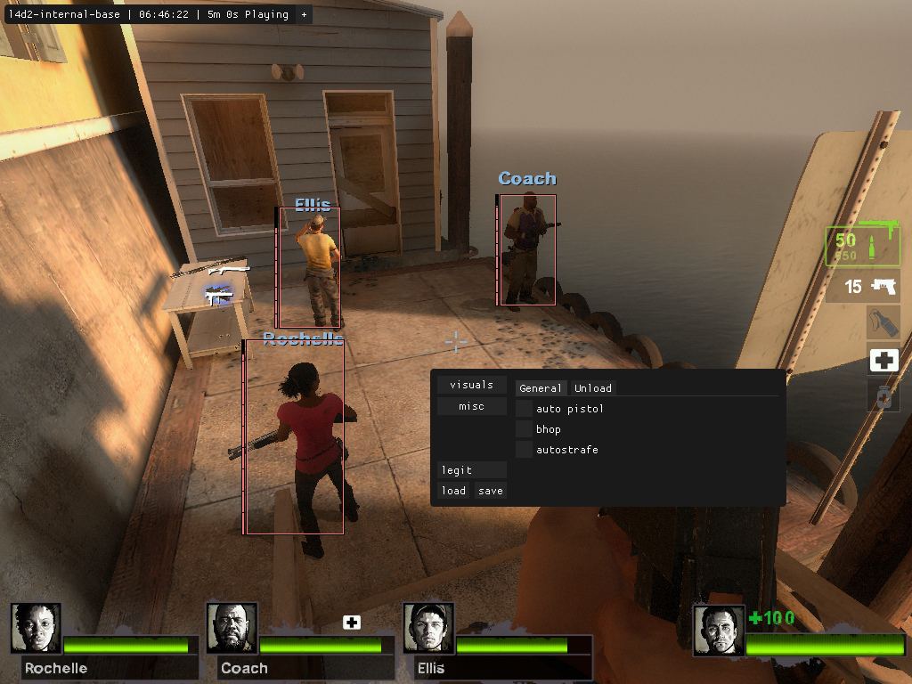

# l4d2-internal-base


Internal base for making hacks for left 4 dead 2  

### Technical features
- 17 & more interfaces
- config system with XOR encrypted inside
- hooks that are mainly used for cheats (there will be more in the future)
- singleplayer bonus features (visuals, misc)
- ui based on imgui

> [!NOTE]
> This is not all yet; the project is still in development.

## Screenshots



## 3rdparty
[imgui](https://github.com/ocornut/imgui)  
[minhook](https://github.com/TsudaKageyu/minhook)

## Using
```
git clone https://github.com/xastrix/l4d2-internal-base
```
Launch l4d2-internal-base.sln, set up your visual studio settings and compile by press <kbd>CTRL + SHIFT + B</kbd>